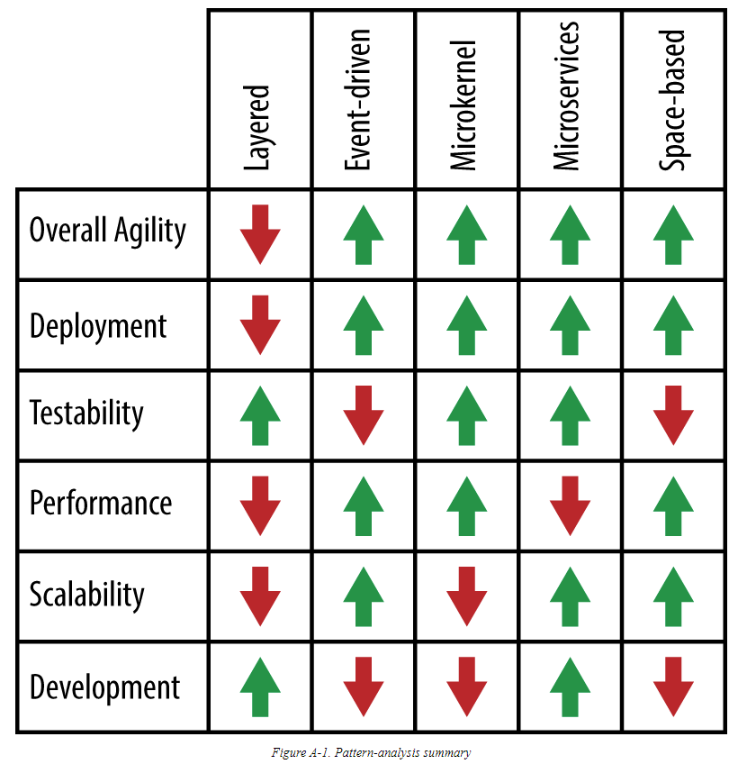
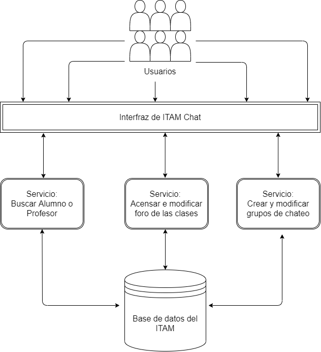

# Arquitectura
## Decidir la Arquitectura
La arquitectura que se implementará para ITAM Chat será una de poca complejidad porque la aplicación no requiere una arquitectura extremadamente compleja. Esto se decidió para que el desarrollo y el mantenimiento de la aplicación sea simple. Los seis aspectos que hay que analizar para determinar la arquitectura del sistema son su agilidad, implementación, testabilidad (la habilidad de probar la aplicación), rendimiento, escalabilidad, y desarrollo.
### Agilidad e Implementación 
Con agilidad se refiere a la habilidad de poder adaptarse a un entorno cambiante y con implementación se refiere a la facilidad de poder implementar y correr funcionalidades. Se va a requerir una agilidad e implementación alta porque se necesita que el sistema pueda mantenerse activo por necesidades inmediatas que puede ocurrir con la aplicación, como por ejemplo preguntas importantes dirigidas a profesores antes de un examen final.
### Testabilidad 
Siempre es mejor tener alta testabilidad pero no siempre es necesario. En este caso, como el mantenimiento y la aplicación se dejará en otras manos, la testabilidad debe ser alta para facilitar el desarrollo de la aplicación de un agente que no desarrolló la aplicación.
### Rendimiento 
En algunas situaciones el rendimiento alto significa mejor aplicación. En el caso de ITAM Chat ,el rendimiento puede ser bajo porque la funcionalidades planeadas para el sistema no implican una necesidad de uno alto.
### Escalabilidad 
Así como la testabilidad debe ser alta para los futuros ingenieros que se vuelvan encargados de trabajar sobre este sistema, se desea una escalabilidad alta para poder implementar, sin mayor dificultades, otras funcionalidades en el futuro conforme se vaya incrementando la necesidad para ellas.
### Desarrollo
El desarrollo debe ser relativamente alto para que sea fácil de programar y para que esté disponible rápidamente para los usuarios. Por condiciones de COVID muchas operaciones del día a día se digitalizaron y se requiere esta aplicación para sustituir unas de ellas.
### Por lo tanto...
En base a estas condiciones la arquitectura que cumple más con los requisitos es la de microservicios (en base a la Imagen: Comparación de Arquitecturas). Con esta arquitectura se pueden mantener todos los aspectos necesarios altos y la única característica que sufre este esto es el rendimiento pero ese no es importante para el sistema que se quiere desarrollar.

Imagen del libro digital de Software Architecture Patterns de Mark Richards en la página www.oreilly.com

## Diseño de Arquitectura

La arquitectura tendrá el siguiente diseño. No está limitada a esa cantidad de servicios, sino es una idea general de cómo debera operar la aplicación.
