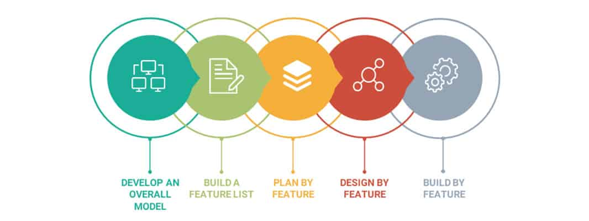

# Metodología
Dado que la arquitectura es de microservicios, la metodología basada en funcionalidades (feature driven development) es la que se va a aplicar para el desarrollo de ITAM Chat. Además por la pandemia conviene dividir el desarrollo en partes claramente separadas y relativamente independientes para limitar el contacto necesario entre los ingenieros.
El siguiente diagrama representa cómo sirve la metodología basada en funcionalidades:

Imagen tomada de https://aist.global/en/use-a-feature-driven-development

#### Otras metodologías que se consideraron:
Se consideró “Agile” pero como la aplicación ya no se actualizará por nuestro equipo, y como “Agile” usa el feedback de los usuarios para mejorar el sistema después de la entrega, se descartó como una opción. 
